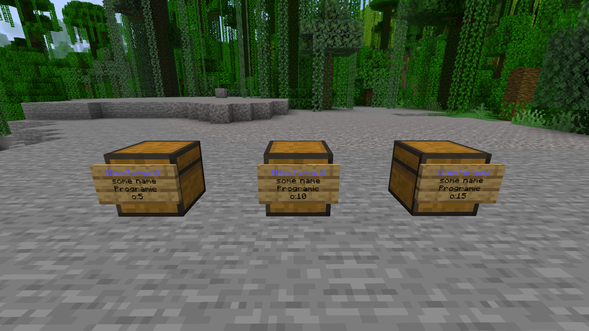
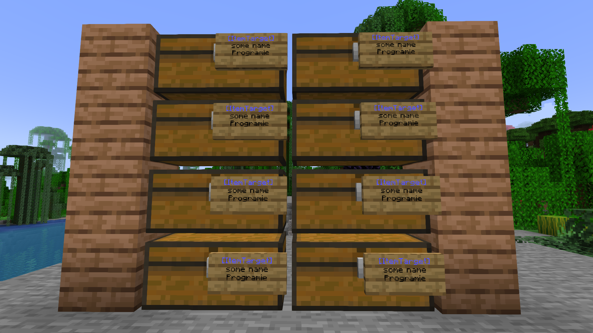
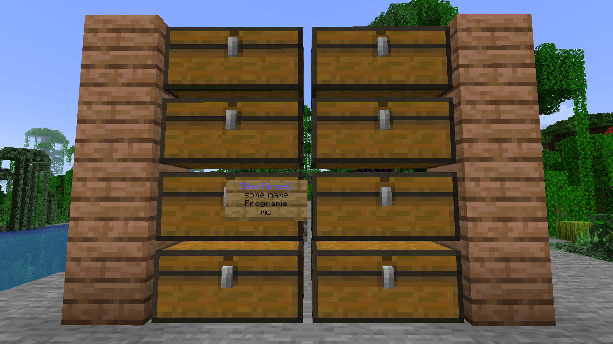

## Introduction

ItemSorter allows players to automatically sort items from a chest (or any other inventory block like hoppers) into any number of target chests (or any other inventory blocks like barrels).

When transferring the items from the source chest into the target chests, the plugin takes a look of already existing items in the target chests and moves items into the chest already containing the specific item type.

## Installation

* Download the latest release and put the Jar file into your plugins folder
* Start your Minecraft server to let the plugin generate the initial configuration

Instructions how to manually build the project can be found on [GitLab](https://gitlab.com/Programie/ItemSorter).

## Configuration

The following options can be configured in the config.yml of the plugin (created on the first load):

* `allow-cross-world-connections` - Allow to connect signs between worlds (i.e. transfer items from the Nether to the Overworld) (`true` or `false`, default: `false`)
* `max-distance` - The maximum distance between source and target chests (`0` = unlimited, default: `100`)
* `max-names-per-player` - The maximum number of different names per player (`0` = unlimited, default: `0`)
* `max-signs-per-name` - The maximum number of signs per name (`0` = unlimited, default: `0`)
* `allow-multi-chests` - Allow multiple chests connected to a single target sign (default: `true`)
* `max-multi-chests-blocks` - The maximum number of chest blocks used for the multi chest feature (`0` = unlimited, default: `0`)

## Permissions

* `itemsorter.create` - Allow to create and destroy your own ItemSorter signs' (Default: everyone)
* `itemsorter.destroyAny` - Allow to destroy any ItemSorter signs (not just your own) (Default: op)
* `itemsorter.*` - Allow access to all features (Default: op)

## How to use it?

Simply place a sign at the side of any inventory block (chest, barrel, hopper, etc.) you would like to use as the source chest containing the following content:

* First line: `[ItemSource]`
* Second line: Any unique name used by the other connected chests

This will define the chest as an item source (i.e. the chest you will throw in your items for the plugin to sort them for you).

After that, place a sign at the side of any inventory block (chest, barrel, hopper, etc.) you would like to use as the target chest containing the following content:

* First line: `[ItemTarget]`
* Second line: Any unique name used by the other connected chests

This will define the chest as an item target (i.e. the chest your items will be moved to).

Next, place any item you would like to sort into the target chest. For example, if you want to move cobblestone into the chest, simply place at least one cobblestone item into the chest.

After that, you are ready to go. Now you may move any item from your player inventory into the source chest and the plugin will try to find the correct target chest for each item.

Any remaining items which can't be sorted into a target chest will remain in the source chest.

### Target order

At some point, you might have multiple chests for a single item type like cobblestone or dirt. In that case, you may also want to define which chest should be filled up first before trying the next one.

To archive that type of target chest order, simply define the order using `o:<any number>` on the fourth line of the sign attached to the target chest:

Example:

* First line: `[ItemTarget]`
* Second line: Any unique name used by the other connected chests
* Third line: Keep empty (will be replaced with your player name)
* Fourth line: `o:10`

A lower number means the chest is used before another with a higher number. By default, any target chest without the order option will have the order number `0`.

If you define multiple chests with the same order number, the order of those chests might be random.

### Multiple chests with a single target sign

Sometimes, you might get at the point where placing lots of signs is really time-consuming and could also decrease the client rendering performance (i.e. if there are hundreds of signs in your storage room).

Think about the follow setup:

In that case, you can use another feature build into this plugin. Simply place a single target sign at any chest and add `mc` (short for "Multi Chests") to the fourth line of it. Any directly connected chests are now connected equally with this target sign.

Example:

* First line: `[ItemTarget]`
* Second line: Any unique name used by the other connected chests
* Third line: Keep empty (will be replaced with your player name)
* Fourth line: `mc`

You may also specify other options like the target order by separating each option with a comma.

Example:

* First line: `[ItemTarget]`
* Second line: Any unique name used by the other connected chests
* Third line: Keep empty (will be replaced with your player name)
* Fourth line: `o:10,mc`

Placing that sign on a chest allows you to connect as many chests as you want (limited by the `max-multi-chests-blocks` config option). You only have to make sure, they are touching each other on any block side.

The previous setup would look like that:

All of those eight chests are connected using the same name `some name`, just like placing a target sign on each of them.

### Show info about sign

Clicking on a ItemSorter sign (left or right click) shows some information about the sign as well as it's connection to the other signs/chests.