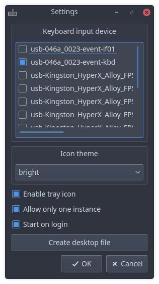
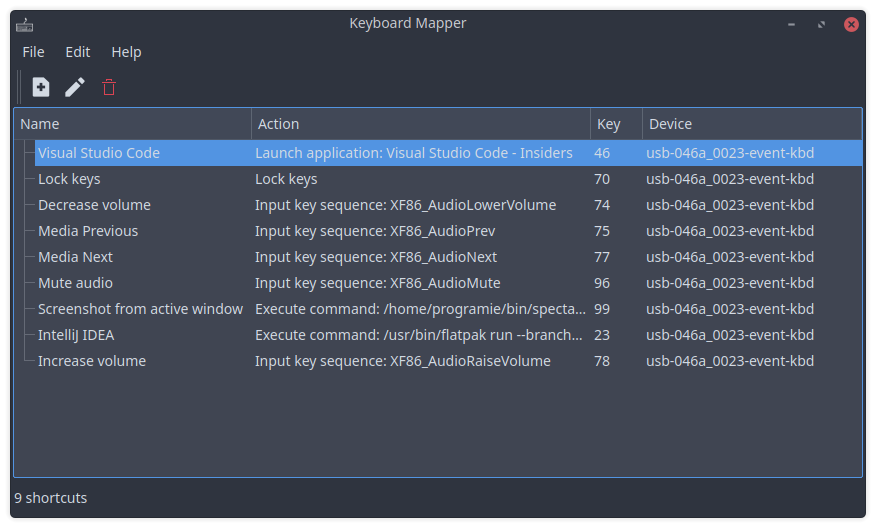
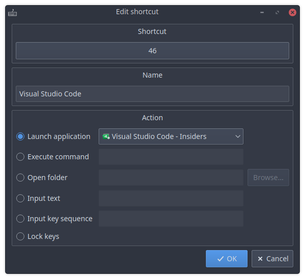

Keyboard Mapper is a small application for Linux desktops allowing you to map keys of different input devices to specific actions.

In that way, it allows you to use a second keyboard as some sort of application launcher. Or you could use unused buttons from your mouse as multimedia keys.

## Requirements

* Python 3.6+

## Installation

* Download the latest release
* Install the required Python modules using pip: `pip3 install -r requirements.txt`

## Initial configuration

In order to let the X server ignore the input from the device used dedicated for your actions, you have to configure the following in your X server configuration:

```
Section "InputClass"
	Identifier      "some unique identifier choosen by you"
	MatchIsKeyboard "on"
	MatchProduct    "The product name of the input device (see "xinput list")"
	Option          "Ignore" "true"
EndSection
```

Also make sure, your user has the permission to access the device files (located in `/dev/input`).

After that, you can start the application and select the input devices to use in the settings as shown bellow.



## Usage

Starting the application will present you the main window:



Add your first entry by clicking the "Add shortcut" button in the toolbar or selecting it from the application menu. This action will open the "Edit shortcut" window:



Click the "Click to set shortcut" button which will prompt you to press the key on the input device to use for your shortcut.

After that, select one of the following actions to do once you press the key:

* Launch application: Select one of your installed applications to launch
* Execute command: Execute the specified command (including all arguments which should be passed to it)
* Open folder: Select any folder you would like to open in your default file browser
* Input text: Send any text to the currently active window (uses the clipboard and sends Ctrl+V to the currently active window)
* Input key sequence: Send any sequence of key combinations to the currently active window (e.g. "Control_L+N Control_L+W" would send Ctrl+N and Ctrl+W)
* Lock keys: Toggle locking of all other actions (only respond to shortcuts with the "Lock keys" action)

## Known issues

### Application theme is different from other applications

When installing PySide2 using pip, it's possible that the application does not use the native desktop theme. In that case, simply install PySide2 using your package manager.

In case of Debian based Linux distributions (e.g. Ubuntu, Mint, etc.), install PySide2 using the following command:

```
sudo apt-get install python3-pyside2.qtcore python3-pyside2.qtgui python3-pyside2.qtwidgets
```

After that, you should remove PySide2 which has been installed by pip using `pip3 uninstall PySide2`. Otherwise, the application continues to use PySide installed with pip.